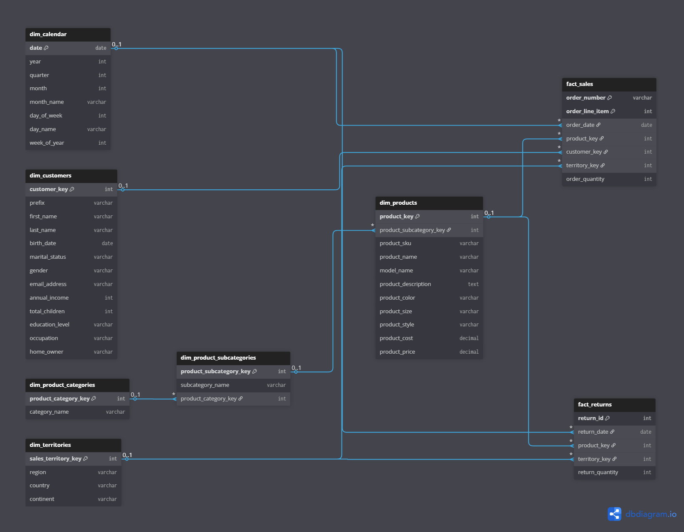
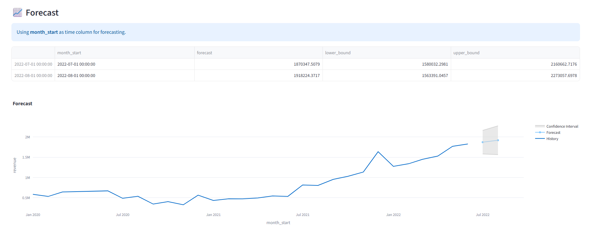

# 🤖 DataGenie — AI Analytics Assistant (Hackathon Project)

## 🎥 Demo

[▶️ Watch the demo]()

This AI-powered analytics assistant built as part of the **DataGenie Hackathon**.

It helps business users ask questions in **plain English**, and automatically converts them into:

✔ SQL queries  
✔ Executable insights  
✔ Visualizations  
✔ Dashboards  
✔ Forecasts  
✔ Human-readable narrative summaries  

—all fully automated.

---

## 🧩 1. Problem Statement

Modern business users (CXOs, analysts, managers) ask questions such as:

> *“Which regions are driving revenue?”*  
> *“What will our revenue look like next year?”*  
> *“Give me an overall performance dashboard.”*

But:

❌ They don’t know SQL  
❌ BI workflows are slow and manual  
❌ Analysts spend time writing repetitive queries  
❌ Insights are not conversational or interactive  

**Goal of DataGenie**

> Build an AI system that can understand business questions —  
> translate them to SQL — visualize results — explain insights — and even forecast future performance.

---

## 📊 2. Database Used (AdventureWorks – Analytics Version)

We use a customized **AdventureWorks** dataset.

| Property | Details |
|--------|--------|
| Domain | Retail & Manufacturing (Bicycles) |
| Records | ~105,000 sales |
| Time period | 2020 – 2022 |
| Customers | ~18,484 |
| Products | 293 |
| Database style | Star Schema |
| Purpose | Analytics, BI, Forecasting |

### Core Metrics

- Revenue
- Profit
- Units Sold
- Returns
- Customer segmentation
- Territory performance
- Time trends

---

## 🧱 3. Database Schema

Data follows a **Star Schema**.

### Fact Tables

| Table | Description |
|------|-------------|
| fact_sales | All sales transactions |
| fact_returns | Product returns |

### Dimension Tables

| Table | Description |
|------|-------------|
| dim_calendar | Dates, year, month, quarter |
| dim_products | Product details |
| dim_product_subcategories | Product classification |
| dim_product_categories | Top-level categories |
| dim_customers | Customer demographics |
| dim_territories | Geography |

---

### 🖼 Schema Diagram



---

### 🧠 Thought Process While Implementing

Below are detailed documents describing the reasoning, dataset understanding, and validation.

- 📄 **Business Thought Process**  
  👉 https://docs.google.com/document/d/1aRAn53-wrZRKZhpXWFdBVv2H_H5po_UV3WE80b4Tr2c/edit?usp=sharing

- 📂 **Dataset Understanding & Notes**  
  👉 https://docs.google.com/document/d/17S9rmcBWbD557eBK97CYqtEJCXoakR8SitNms5YywNc/edit?usp=sharing

- 📊 **Validation Sheet (Query vs Response)**  
  👉 https://docs.google.com/spreadsheets/d/1jIePv10FB1KcGvaY56ocF8_Yqx8NkZvLjabP-3X_b_A/edit?usp=sharing

---

### 📂 Codebase Structure

```text
DataGenie-Analytics/
│
├── agents/
│   ├── query_validator_agent.py        # validates user question + intent
│   ├── sql_agent.py                    # converts analysis goal -> SQL
│   ├── visualization_agent.py          # decides best chart + spec
│   ├── dashboard_agent.py              # generates CXO dashboard questions
│   ├── narrative_agent.py              # natural-language insights
│   ├── sql_feedback_agent.py           # fixes broken SQL
│
├── tools/
│   ├── data_extractor_tool.py          # executes SQL on DB
│   ├── plots_render_tool.py            # renders charts + saves images
│   ├── forecast_tool.py                # time-series forecasting logic
│   ├── dashboard_builder_tool.py       # builds combined dashboard page
│
├── schema/
│   ├── schema.json                     # logical star-schema reference
│   └── schema_prompt.py                # LLM schema instructions
│
├── visualizations/
│   └── YYYY-MM-DD/                     # auto-saved generated charts
│
├── app.py                              # Streamlit user interface
├── main.py                             # CLI pipeline orchestration
└── README.md

```
---

### Forecasted screenshot

